<div align="center">


# Legilimens

### The Seer will name your trade.

**An on-chain fortune booth where an AI fortune-teller guesses your job in ten questions.**<br/>
Stake 1 USDC. Seal your job in wax. If the Seer names it, it keeps your coin.<br/>
If it can't, you take half the pot. And if you lie to it, the seal knows.

`Arc` · `The Graph` · `ENS` &nbsp;·&nbsp; built for **ETHOnline 2026**

</div>

---

## Contents

- [How a game works](#how-a-game-works)
- [Architecture](#architecture)
- [The Seer's brain](#the-seers-brain)
- [Settlement: who gets paid](#settlement-who-gets-paid)
- [Catching liars on-chain](#catching-liars-on-chain)
- [Provable fairness](#provable-fairness)
- [The Seer's economy](#the-seers-economy)
- [The Seer on ENS](#the-seer-on-ens)
- [Sponsor tracks](#sponsor-tracks)
- [Deployments](#deployments)
- [Run it locally](#run-it-locally)
- [Repository layout](#repository-layout)
- [Trust boundaries and known limits](#trust-boundaries-and-known-limits)

---

## How a game works

<table>
<tr>
<td align="center" width="20%"><br/><sub><b>1. Challenge</b><br/>Connect your wallet and stake 1 USDC</sub></td>
<td align="center" width="20%">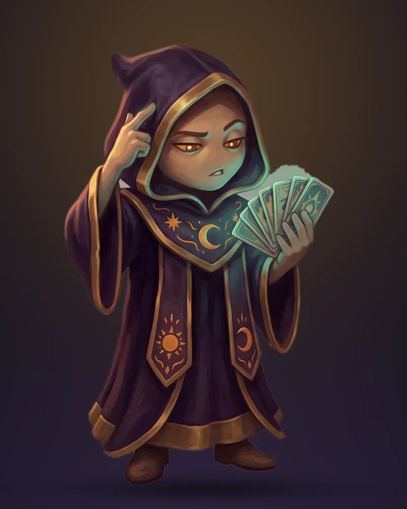<br/><sub><b>2. Seal &amp; answer</b><br/>Commit your job, answer 10 questions</sub></td>
<td align="center" width="20%"><br/><sub><b>3. The guess</b><br/>The Seer names a trade on-chain</sub></td>
<td align="center" width="20%"><br/><sub><b>4a. Seer wins</b><br/>Your stake joins the pot</sub></td>
<td align="center" width="20%">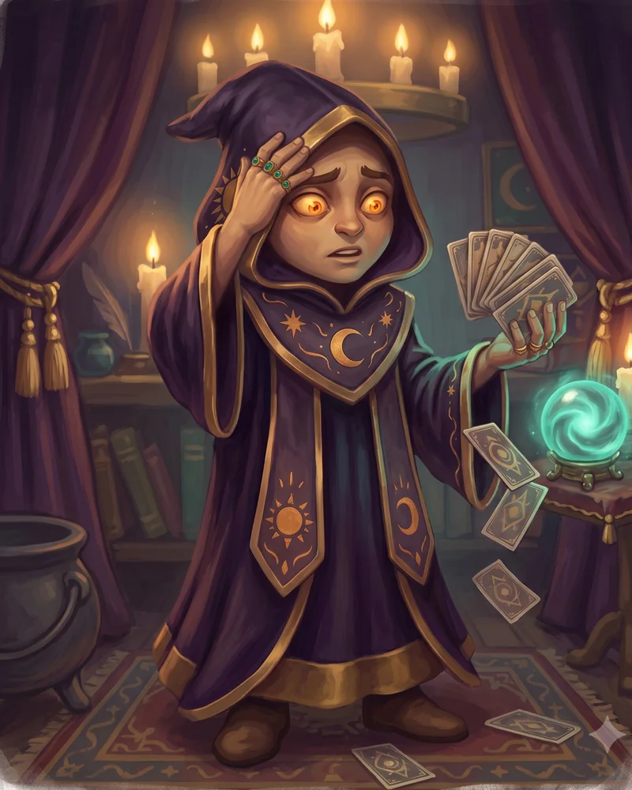<br/><sub><b>4b. You win</b><br/>Stake back + half the pot</sub></td>
</tr>
</table>

1. **Challenge the Seer.** Connect a wallet on Arc testnet. Each wallet gets **3 games a day**, enforced on-chain.
2. **Seal your trade.** Pick your job from a ledger of 66 occupations. Only `keccak256(jobCode, salt)` goes on-chain: you can't change your job later, and the Seer can't peek.
3. **Answer ten questions** with *Yes · Probably · Probably not · No*. The Seer picks each question to learn as much as possible about you.
4. **The Seer guesses.** Its wallet posts the guess plus its seed and the full transcript on-chain.
5. **Break the seal.** You reveal your job and salt, and **the contract alone** decides the outcome and pays out in the same transaction.
6. **Your reading is inscribed on ENS.** The Seer writes your record to your own name, `<wallet>.players.legilimens.eth`. Get caught lying twice and it won't read you again.

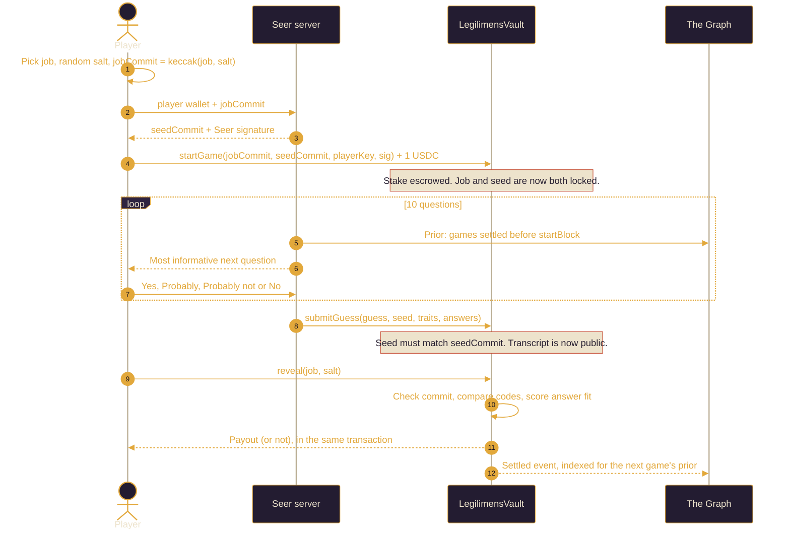

---

## Architecture

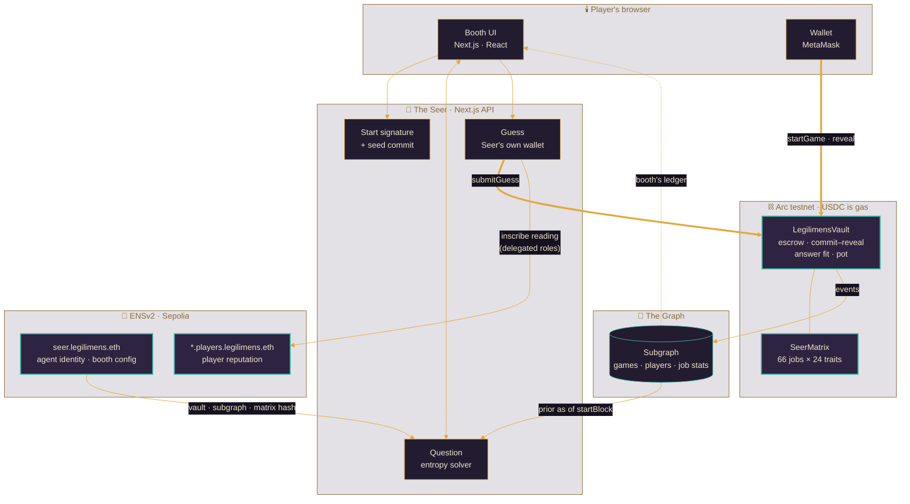

| Layer | What it does | Where |
|---|---|---|
| **Contract** | Escrows stakes, locks the job and seed commitments, enforces the per-wallet daily quota, scores answer fit, settles and pays out atomically | [`contracts/src/LegilimensVault.sol`](contracts/src/LegilimensVault.sol) |
| **On-chain matrix** | The Seer's knowledge, generated from `matrix.json` so the solver and contract can never drift | [`contracts/src/SeerMatrix.sol`](contracts/src/SeerMatrix.sol) |
| **Solver** | Bayesian posterior over 66 jobs, picks the most informative question with a seeded softmax | [`web/lib/solver.ts`](web/lib/solver.ts) |
| **Server** | Start signatures, question and guess routes, ENS reputation writes. Stateless: its config comes from ENS and seeds are re-derived from chain data | [`web/app/api`](web/app/api) |
| **ENS** | The Seer's agent identity and published config (`seer.legilimens.eth`), plus the player reputation names it is delegated to write | [`web/lib/server/booth.ts`](web/lib/server/booth.ts), [`reputation.ts`](web/lib/server/reputation.ts), [`scripts/ens-setup.ts`](web/scripts/ens-setup.ts) |
| **Subgraph** | Indexes every game; the Seer's prior and the booth's ledger read from it | [`subgraph/`](subgraph) |
| **Frontend** | The candlelit booth: wax seals, scrying orb, filling pot, the Seer's candle | [`web/components`](web/components) |

---

## The Seer's brain

The Seer isn't a chatbot guessing freely. It's a **deterministic Bayesian solver** over a published job × trait matrix, so every game can be replayed and audited.

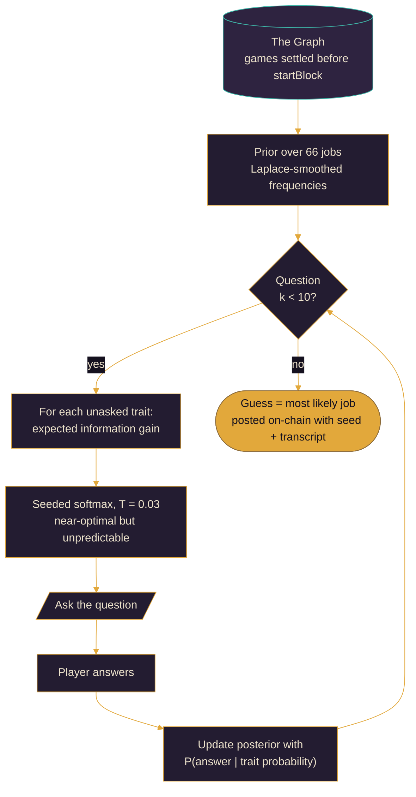

- **Seeded, not fixed.** The question order depends on a seed the Seer commits to *before* play. There's no fixed decision tree a player could map offline, yet anyone can replay a game once the seed is revealed.
- **Learns from history.** The prior comes from The Graph. With only 3 games of history, previously seen jobs doubled their prior (1.52% → 2.90%) and **12.5% of games got a different first question**. The effect grows as more games are played.
- **Calibrated by simulation** ([`web/scripts/sim.ts`](web/scripts/sim.ts)): 10 questions at temperature 0.03 over noisy simulated honest players gives:

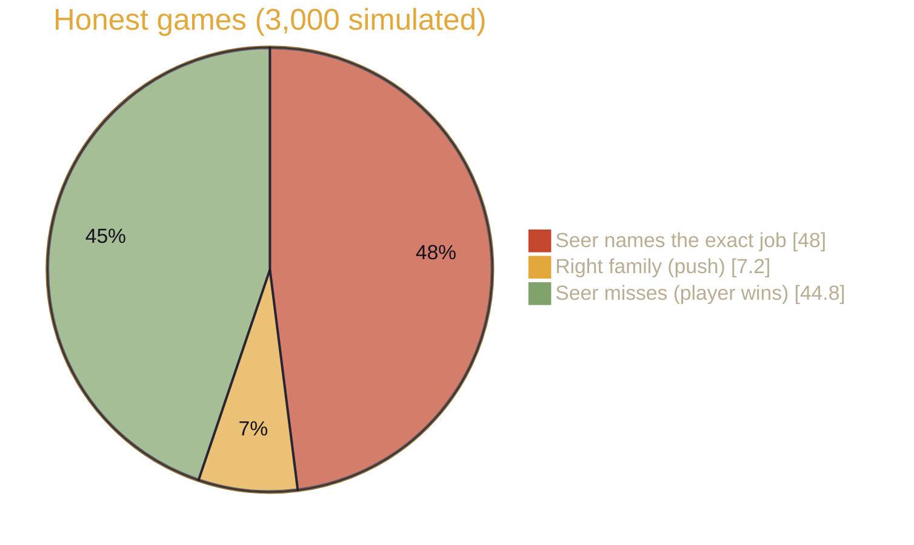

The Seer wins often enough to keep the pot alive, and loses often enough that challenging it is worth it.

---

## Settlement: who gets paid

Nobody but the contract decides. The Seer must post its guess **before** you reveal, and your commitment stops you changing your job after seeing the guess.

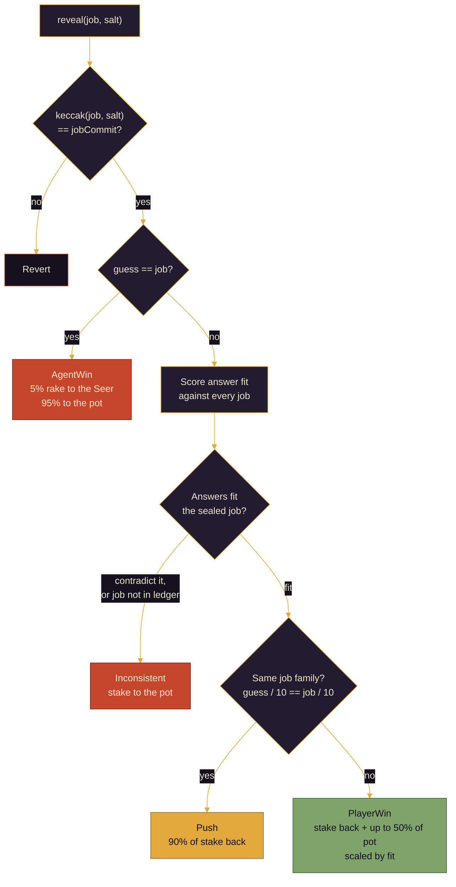

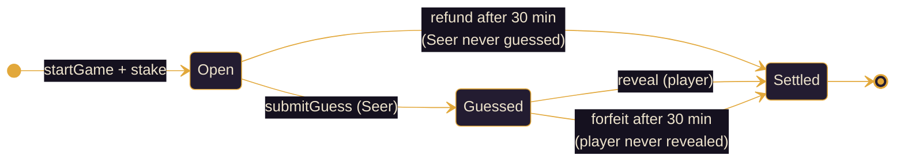

A player who lost has no reason to reveal, and the timeout forfeit gives exactly the same result as losing, so walking away gains nothing.

---

## Catching liars on-chain

**The attack:** seal "Firefighter", then answer like an accountant. The Seer guesses wrong, and before this check you walked off with half the pot. In simulation, **a blatant liar won 98.6% of the time**.

**The defence:** when the seal breaks, the contract checks how well the published answers fit the sealed job, compared with the best-fitting job in the whole ledger:

$$\text{fit} = \log L(\text{answers} \mid \text{sealed job}) \;-\; \max_{j} \log L(\text{answers} \mid j)$$

- Computed **entirely on-chain** in integer milli-nats, with the matrix and log-likelihood table embedded in [`SeerMatrix.sol`](contracts/src/SeerMatrix.sol). No oracle, no trusted judge.
- Bit-for-bit identical to `consistency()` in [`solver.ts`](web/lib/solver.ts); a Foundry test asserts exact score parity.
- Costs about 480k gas at reveal, around **0.02 USDC** on Arc.

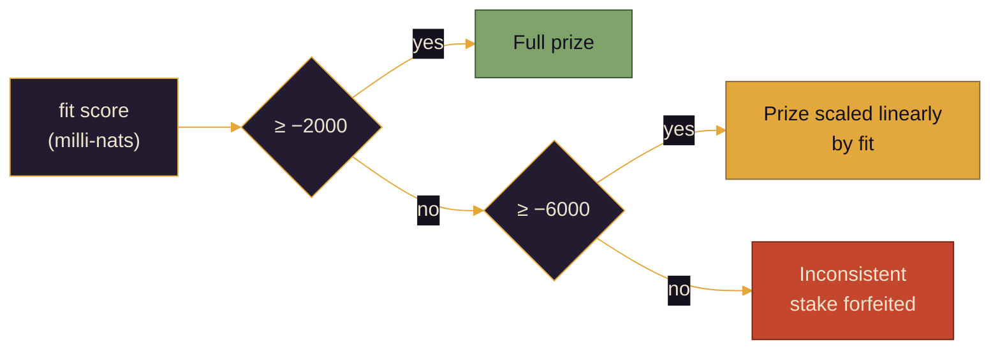

**Expected profit per game** in stakes, simulated with the pot at its usual level (about 2 stakes):

| Player strategy | Before the check | After the check | Forfeited |
|---|---:|---:|---:|
| Honest | −0.06 | −0.08 | 1.2% |
| Blatant liar (answers as another job) | **+0.97** | **−0.44** | 61% |
| Smart liar (lies only on ambiguous questions) | +0.20 | +0.15 | 1.5% |

**Proven on testnet:** game #5 sealed *Nurse* and answered as another job, and the Seer was fooled into guessing *Police Officer*. The old vault would have paid out; this one settled **Inconsistent** with a fit score of −9173 and sent the stake to the pot.

> **The residual edge.** Lying only on genuinely ambiguous questions ("is creativity central to your job?") is statistically indistinguishable from honest uncertainty, so no scoring rule can remove it. It's small: about 0.15 stakes per game, and at most 3 games a day per wallet. Someone willing to fund many wallets can repeat it, which is the price of having no proof-of-personhood gate.

---

## Provable fairness

Everything needed to audit a game is public:

| What | Where it lives | What it proves |
|---|---|---|
| `jobCommit` | `GameStarted` / `games(id)` | The player's job was fixed before question 1 |
| `seedCommit` → `seed` | `startGame` → `GuessSubmitted` | The Seer's question order was fixed before play |
| `traits`, `answers` | `GuessSubmitted` (bytes10 each) | Exactly what was asked and answered |
| `startBlock` + subgraph | `GameStarted`, The Graph | The prior the Seer used (settled games before that block) |
| `MATRIX_HASH` | `LegilimensVault.MATRIX_HASH()` | The Seer's knowledge, `keccak256` of [`web/lib/matrix.json`](web/lib/matrix.json) |
| `fitScore`, `fitBps` | `Settled` event | How the answer-fit verdict was reached |

**Matrix hash:** `0x9af0f7fd282328233db1cfcc1ba544ddff1dd1c5e591dd92d0e88c127d2a0bdf`

Check any transcript's fit against the live contract:

```bash
cast call 0x8286DE5954296D78ce2f276424F9dEe3a60bA9D8 \
  "fit(uint16,bytes10,bytes10)(int256,uint256,bool)" \
  2221 0x00010203040506070809 0x00000303030303000000 \
  --rpc-url https://rpc.testnet.arc.network
# → -373  10000  false   (an honest nurse transcript: full prize)
```

### Replay any game in one command

[`web/scripts/replay.ts`](web/scripts/replay.ts) rebuilds a game from public data only, with no secrets and no access to our server, and checks that the Seer played by its published algorithm:

```bash
cd web
node scripts/replay.ts 5        # one game
node scripts/replay.ts all      # every game the Seer has guessed
```

```
Game #5 · sealed Nurse · Seer guessed Police Officer · Inconsistent
  ✓ seed matches the commitment made before play
  ✓ prior rebuilt from 1 earlier settled game on-chain (before block 61887212)
  ✓ The Graph reports the same history
  ✓ questions 1–10 match the Seer's published transcript
  ✓ final guess matches: Police Officer
  ✓ fit score -9173 (0% of prize) matches this repo's scorer and the contract
  The Seer played this game exactly by its published algorithm.
```

It checks five things:
1. The matrix in the repo is the one committed on-chain.
2. The revealed seed matches the Seer's pre-game commitment.
3. The prior is rebuilt **from on-chain `Settled` events** and cross-checked against The Graph.
4. Re-running the solver reproduces every published question and the final guess.
5. The answer-fit verdict matches both the TypeScript scorer and the contract's `fit()`.

Any mismatch prints ✗ and exits non-zero.

---

## The Seer's economy

The Seer is an autonomous economic actor on Arc. **Its only income is its 5% rake, and it pays for its own gas out of it.** Because USDC is Arc's gas token, its income and its running costs are in the same currency, with no conversion.

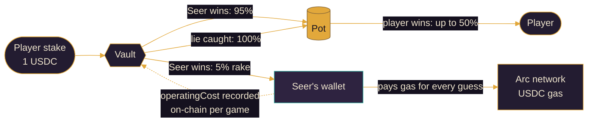

- **Solvent by construction.** Winners take a *share* of the pot, never a fixed amount, so the pot can never pay out more than it holds. A Foundry test checks that the vault's balance always equals its recorded pot.
- **Runway.** The UI shows the Seer's candle: how many more games its wallet can pay for at its recorded cost per game. A Seer that keeps losing earns nothing and eventually can't afford to think.

---

## The Seer on ENS

The Seer is an AI agent, and ENSv2 gives it a **namespace with delegated permissions**. Legilimens uses that as real infrastructure.

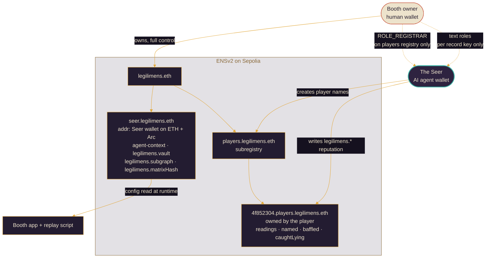

**1. The Seer's identity and config live on its name.** `seer.legilimens.eth` publishes:
- its wallet, as address records for both Ethereum and Arc (ENSIP-11 coin type)
- ENSIP-26 agent records: `agent-context` and `agent-endpoint[web]`
- `legilimens.vault`, `legilimens.subgraph`, `legilimens.matrixHash` and `legilimens.vaultDeployBlock`

The app and the replay script **read their configuration from these records at runtime**, so there are no hard-coded addresses. The server also checks that the published matrix hash and wallet match what the vault actually enforces before trusting them. Moving the booth to a new vault means updating one ENS record.

**2. The agent gets narrow, delegated permissions.** The booth owner keeps full control of `legilimens.eth` and grants the Seer's wallet only two things through ENSv2 Enhanced Access Control:
- `ROLE_REGISTRAR` on the `players.legilimens.eth` subregistry, so it can create player names and do nothing else on the registry
- permissioned-resolver text roles scoped to **individual record keys** (`legilimens.readings`, `legilimens.caughtLying`, and so on)

The setup script checks on-chain that the Seer *can* write a player's reading and *cannot* change its own published vault record.

**3. Players own reputation they can't forge.** After each game the Seer registers `<wallet-prefix>.players.legilimens.eth`, owned by the player, and writes their record: readings, named, close, baffled, caughtLying and lastReading. The player owns the name but holds no roles on it, so they can't point it at another resolver to hide a bad record.

**4. The Seer remembers liars.** Before authorising a game, the Seer reads the player's name. Anyone with `legilimens.caughtLying ≥ 2` is refused. This was verified on testnet: a wallet caught lying in games #12 and #13 was turned away on its next attempt.

---

## Sponsor tracks

### Arc: DeFi and Agentic Economy

- **Stablecoin-native game:** native USDC stakes, escrow and payouts, with a self-balancing progressive pot.
- **An agent with a wallet:** the Seer signs games, posts its guesses, earns rake and pays its own gas in USDC. Its operating costs are recorded on-chain.
- **Trustless settlement:** the commit–reveal, the answer-fit scoring and the payout all happen in one transaction.

### The Graph: AI use case

- **Load-bearing for the AI.** The Seer's prior over occupations is read from the subgraph (games settled before each game's start block), and it measurably changes which questions get asked.
- **Deterministic by design.** Querying only games settled before the start block makes every prior reproducible for replays.
- **Product surface:** the booth's ledger (recent readings, Seer win and loss counts, caught liars) comes straight from the subgraph.

### ENS: Best Use of ENSv2

- **An AI agent as a namespace with delegated permissions.** `seer.legilimens.eth` is the agent's identity (ENSIP-26 records), and the owner delegates it `ROLE_REGISTRAR` on a subregistry and **per-key** text roles through the Permissioned Resolver. That's Enhanced Access Control used for exactly what it's for.
- **Central, not cosmetic.** The app and replay script take their configuration from ENS, player reputation lives on ENS names, and that reputation gates who may play.
- **Hierarchical registries:** `legilimens.eth` → `players.legilimens.eth` subregistry → per-player names, resolved through the ENSv2 Universal Resolver.


---

## Deployments

| | Arc testnet (chain 5042002) |
|---|---|
| **LegilimensVault** | [`0x8286DE5954296D78ce2f276424F9dEe3a60bA9D8`](https://testnet.arcscan.app/address/0x8286DE5954296D78ce2f276424F9dEe3a60bA9D8) · block `61886523` |
| **Seer wallet** | [`0x7224F3c2E7c97Bbde716d123C3Ad6865AdAA7080`](https://testnet.arcscan.app/address/0x7224F3c2E7c97Bbde716d123C3Ad6865AdAA7080) |
| **Subgraph** | `https://api.studio.thegraph.com/query/1760267/guessworker/v0.0.2` |
| **Stake** | 1 USDC |

| | ENSv2 (Sepolia) |
|---|---|
| **Booth** | [`legilimens.eth`](https://sepolia.app.ens.domains/legilimens.eth) |
| **The Seer** | [`seer.legilimens.eth`](https://sepolia.app.ens.domains/seer.legilimens.eth) |
| **Players** | `players.legilimens.eth` subregistry `0x5172382035fEb06171beE68F1eE6D873Bd6d2870` |
| **Resolver** | Permissioned resolver `0x6618dA29fbF236B556180e366077139006060C3b` |

**Live app:** https://legilimens-rho.vercel.app

---

## Run it locally

**Prerequisites:** Node 20+, pnpm, [Foundry](https://book.getfoundry.sh/).

```bash
git clone --recurse-submodules https://github.com/TheRealRajdeep/ethonline.git
cd ethonline
```

### Contracts

```bash
cd contracts
forge test            # 27 tests, incl. solver/contract score parity and solvency
```

Deploy to Arc testnet (the deployer seeds the pot; the agent address is the Seer):

```bash
AGENT_ADDRESS=0xYourSeer forge script script/Deploy.s.sol \
  --rpc-url arc_testnet --broadcast --private-key $DEPLOYER_KEY
```

If you change `web/lib/matrix.json`, regenerate the on-chain copy with `node web/scripts/gen-matrix-sol.ts`.

### Web app

```bash
cd web
pnpm install
cp .env.example .env.local   # Seer key + seed secret; vault and subgraph come from seer.legilimens.eth
pnpm dev                     # http://localhost:3000
```

> **Font:** the Grostel display font in `web/assets/fonts/grostel/` is a demo-licensed font from Zeenesia Studio (license in `misc/`). Point `web/app/layout.tsx` at another font for any commercial use.

### ENS

```bash
cd web
node scripts/ens-setup.ts    # idempotent: registers legilimens.eth, the Seer and players names, delegates roles, publishes records
```

It reads the vault and subgraph from `.env.local` once, publishes them on `seer.legilimens.eth`, and generates the booth owner's key into `.env.local` if one isn't there. The owner key is only for setup; never deploy it to the app host.

### Subgraph

```bash
cd subgraph
pnpm install
pnpm codegen && pnpm build
npx graph auth <deploy-key>
npx graph deploy guessworker --version-label v0.0.X
```

### Simulations and end-to-end tests

```bash
cd web
node scripts/sim.ts 3000                         # Seer calibration + hardest jobs
APP_URL=http://localhost:3000 RPC_URL=https://rpc.testnet.arc.network \
  VAULT=0x8286… PLAYER_KEY=0x… node scripts/e2e-local.ts 5411          # honest game
LIAR=1 … node scripts/e2e-local.ts 2221                                 # liar game → Inconsistent
RECORD=1 … node scripts/e2e-local.ts 5411                               # also inscribe the reading on ENS
```

---

## Repository layout

```
contracts/        Foundry: LegilimensVault, generated SeerMatrix, tests, deploy script
subgraph/         The Graph: schema, mappings, manifest (network: arc-testnet)
web/
  app/api/        start signing, question, guess, booth config and ENS reputation routes
  components/     Booth flow + props (Seer card, wax seal, orb, pot, candle, coins)
  lib/            solver.ts, matrix.json, commit–reveal helpers, server clients
  scripts/        sim, e2e, replay, ENS setup, matrix → Solidity generator
art/              Art pipeline: process_art.py turns raw art into web assets
DESIGN.md         Full product and visual design, plus the mascot brief
CHECKLIST.md      Build checklist and shared technical decisions
```

---

## Trust boundaries and known limits

| Guarantee | Status |
|---|---|
| Player can't change their job after seeing the guess | **Trustless** (commit–reveal) |
| Seer can't change its question order after seeing answers | **Trustless** (seed commit) |
| Outcome and payout | **Trustless** (contract settles atomically) |
| Lying to fool the Seer doesn't pay | **Trustless** (on-chain answer-fit check), except the small smart-liar edge above |
| Pot can't be over-drawn | **Trustless** (share-of-pot payouts, invariant tested) |
| 3 games a day per wallet | **Trustless** (on-chain quota keyed by `keccak256(wallet)`). There's no proof-of-personhood, so one person can play from several wallets |
| The `traits` the Seer publishes match the questions it actually asked | **Publicly verifiable** by replaying the solver from seed + answers + prior |
| The Seer's matrix is the published one | **Verifiable:** `MATRIX_HASH` on-chain, also published on `seer.legilimens.eth` |
| The booth's config is authentic | **Verifiable:** read from `seer.legilimens.eth`, owned by the booth owner; the server rejects records that don't match the vault |
| Player reputation is accurate | **Delegated agent:** only the Seer can write `legilimens.*` keys, and only from settled on-chain games. The writes happen just after settlement on Sepolia, not atomically with the Arc payout |
| Liars get refused | **Trusted server:** the Seer checks `caughtLying` before signing a start. A liar can switch to a fresh wallet |

**Roadmap**
- A "verify this game" button in the UI, running the replay in the browser.
- Richer ledger of occupations; LLM-phrased questions on top of the same deterministic solver.
- Arc mainnet deployment.

---

<div align="center">
<br/>
<sub>Built for ETHOnline 2026. The seal does not lie.</sub>
</div>
